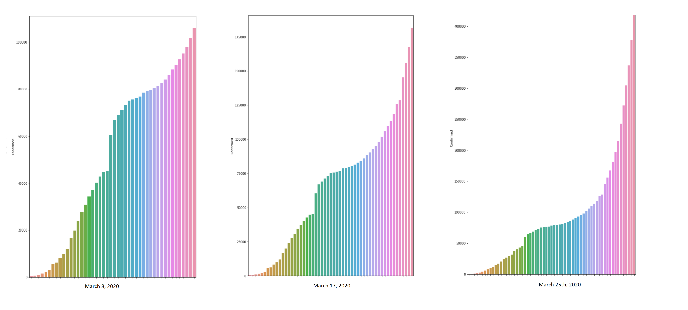

# covid19 case network
covid19 case network web app, distributed network and deep learning model.





The problem with the current systems in place is there are limited means of sharing covid information among facilities. There is limited self-testing, limited ways to report cases, overall the only reliable source is via excel files that are being updated every couple hours. There are multiple excel files of data with different formats and updating the data is manual and time consuming. 
There is a lack of visibility into submitted cases by region and facilities available by region. There needs to be a better way to reference how new cases emerged. There needs to be a better way to communicate effective treatments and sharing data across regions, facilities and medical offices.
There is different formats, numbers of columns and it is difficult for people to report cases themselves. 
The web app allows users to submit cases and messages between organizations on the network.
The case is created on the network and sent to the main Corona Virus Case Network. 


## Web App:

```bash

git clone https://github.com/domsteil/covid19
cd client
npm install
npm run dev

```


## Case Network


1) Deploy the Nodes


```bash

gradlew.bat deployNodes (Windows) OR ./gradlew deployNodes (Linux)

```

3) Run the Nodes

```bash

cd workflows
cd build 
cd nodes
runnodes.bat (Windows) OR ./runnodes (Linux)

```
4) Run the Spring Boot Server

```bash

cd ..
cd ..
cd server
../gradlew.bat bootRun -x test (Windows) OR ../gradlew bootRun -x test

```
The Covid Case Network API Swagger will be running at `http://localhost:8080/swagger-ui.html#/`


## Case Network Structured Data:


The Case will use a shared structured format:

```jsx

@BelongsToContract(CaseContract::class)
data class Case(val caseId: UUID,
                val caseName: String,
                val caseNumber: String,
                val summary: String,
                val province: String,
                val country: String,
                val latitude: String,
                val longitude: String,
                val date: java.util.Date,
                val caseReference: Case,
                val caseStatus: CaseStatus,
                val casePriority: CasePriority,
                val submitter: Party,
                val processor: Party,
                override val linearId: 
```

Messages can be sent on the network in structured format:

```jsx
@BelongsToContract(MessageContract::class)
data class Message(val id: UniqueIdentifier,
                   val body: String,
                   val fromUserId: String,
                   val to: Party,
                   val from: Party,
                   val toUserId: String,
                   val sentReceipt: Boolean?,
                   val deliveredReceipt: Boolean?,
                   val fromMe: Boolean,
                   val time: String?,
                   val messageNumber: String,
                   override val linearId: UniqueIdentifier = UniqueIdentifier())
```

Tabular data from the distributed network can be exported for Deep Learning and Analytics. Find out faster where cases are emerging. Where to quarantine. Case References can also be used.

The Deep Learning Notebooks can be found in the /notebooks dir. 
